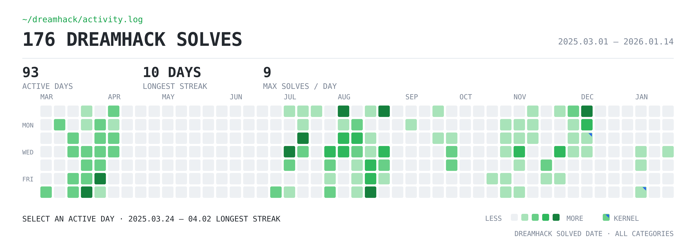

<p align="right"><a href="./README.md">English</a></p>

# 하태구 · Taegu Ha

**Vulnerability Researcher · Systems & Product Security**

AI 에이전트 플랫폼, 네이티브·임베디드 소프트웨어, 무선 스택, 웹 제품, 운영체제 커널 등 실제 제품의 보안 경계를 분석합니다. 최근에는 PraisonAI와 Langflow의 코드 실행 경로, libpng와 arduino-esp32의 메모리 안전성 결함, Apache NimBLE의 원격 BLE parser 오류, 그리고 수정이 mainline에 반영된 Linux 커널 CVE 2건을 다뤘습니다. 자동화와 LLM은 조사 범위를 좁히는 데 사용하되 취약점의 증거로 취급하지 않으며, 공격자 도달 가능성·통제된 재현·책임 있는 공개·패치 근거를 사람이 직접 검증합니다.

[공개 CVE 사례](https://github.com/foxirain/CVE-public) · [대표 취약점 연구](#대표-취약점-연구) · [Dreamhack](https://dreamhack.io/users/71306) · [이메일](mailto:hataegu0826@gmail.com)

```text
공격 표면 → 도달 가능성 → 불변조건 위반 → 통제된 재현 → 공개 → 패치
```

## 핵심 증거

| 증거 | 공개 기록 |
| --- | --- |
| **CVE 사례 15건 · 직접 공개 귀속 13건** | source provenance와 SHA-256 evidence manifest를 보존한 공개 분석 자료 |
| **AI Platform / Agent 사례 3건** | PraisonAI workflow injection · PraisonAI A2A-to-`eval()` RCE · Langflow ToolGuard 검증 우회 |
| **Native / Embedded / Wireless CVE 3건** | libpng · arduino-esp32 · Apache NimBLE |
| **Web / Authorization / Product 사례 7건** | LinkAce · NamelessMC · OpenFGA · Caddy · listmonk |
| **Linux Kernel CVE 2건 · mainline patch 3건** | USB UAC1 · PPP namespace authorization · BPF verifier |
| **Dreamhack Pwnable 154문제** | [Wargame 총 4,901점](https://dreamhack.io/users/71306) · 장기 시스템 익스플로잇 학습 |

<sub>공개 사례 수와 직접 귀속 수는 집계 범위가 다르며 서로 더하는 수치가 아닙니다. Langflow 사례는 개인 보고 증빙 사례이며 공식 공개 연구자 귀속을 주장하지 않습니다. Advisory credit은 foxirain과 Amemoyoi 이름으로 공개됩니다.</sub>

## 대표 취약점 연구

| 분야 | 취약점과 공격 표면 | 근거 |
| --- | --- | --- |
| **AI 플랫폼·Agent Workflow** | Langflow ToolGuard 검증 우회를 통한 stored Python execution · PraisonAI 공개 A2A에서 LLM tool `eval()`까지 이어지는 RCE · 신뢰하지 않은 fork branch 이름을 통한 privileged workflow command injection | [CVE-2026-9135](https://github.com/foxirain/CVE-public/tree/main/cases/CVE-2026-9135) · [CVE-2026-47391](https://github.com/foxirain/CVE-public/tree/main/cases/CVE-2026-47391) · [CVE-2026-48168](https://github.com/foxirain/CVE-public/tree/main/cases/CVE-2026-48168) |
| **Native·Embedded·Wireless** | libpng ARM/AArch64 NEON OOB read/write · arduino-esp32 NBNS OOB read와 stack overflow · Apache NimBLE의 잘린 BLE ATT 응답 assertion | [CVE-2026-33636](https://github.com/foxirain/CVE-public/tree/main/cases/CVE-2026-33636) · [CVE-2026-41429](https://github.com/foxirain/CVE-public/tree/main/cases/CVE-2026-41429) · [CVE-2026-45815](https://github.com/foxirain/CVE-public/tree/main/cases/CVE-2026-45815) |
| **Web·Authorization·Product Security** | LinkAce SSRF와 private note 노출 · NamelessMC hidden content와 OAuth state 결함 · OpenFGA cache isolation 우회 · Caddy path normalization 불일치 · listmonk 권한 누락 | [7개 사례 archive](https://github.com/foxirain/CVE-public) |
| **Linux Kernel·Upstream** | USB UAC1 stack OOB write · cross-netns PPP capability validation · CVE 수정 2건과 별도 BPF verifier 수정 upstream 반영 | [CVE-2026-31720](https://github.com/foxirain/CVE-public/tree/main/cases/CVE-2026-31720) · [CVE-2026-53075](https://github.com/foxirain/CVE-public/tree/main/cases/CVE-2026-53075) · [mainline patch 3건](#linux-mainline-기여) |

**보조 연구 도구:** [Adaptive OSS Vulnerability Harness](https://github.com/foxirain/codex-adaptive-oss-vuln-harness) · [Kernel Codex Harness](https://github.com/foxirain/linux-kernel-codex-harness-v2) · [Agent Security Company](https://github.com/foxirain/agent-security-company)

## Linux mainline 기여

- [`6e0e34d85cd4`](https://git.kernel.org/pub/scm/linux/kernel/git/torvalds/linux.git/commit/?id=6e0e34d85cd46ceb37d16054e97a373a32770f6c) — USB UAC1 control-request length validation · CVE-2026-31720
- [`2bb6379416fd`](https://git.kernel.org/pub/scm/linux/kernel/git/torvalds/linux.git/commit/?id=2bb6379416fd19f44c3423a00bfd8626259f6067) — PPP target-network-namespace capability validation · CVE-2026-53075
- [`de36adca6346`](https://git.kernel.org/pub/scm/linux/kernel/git/torvalds/linux.git/commit/?id=de36adca634634c205a9eb8b56a28175ab7abf5f) — BPF verifier oversized access-size validation 및 regression test

## 시스템 익스플로잇 기반

[**Dreamhack · Amemoyoi**](https://dreamhack.io/users/71306) · [장기 프로젝트 기록](https://whoami-iota-gilt.vercel.app/3c97c60c09f3810dbf87dc57e6603f3e)

- Memory Corruption, ROP/SROP, Heap, glibc/FSOP, ARM/AArch64, Linux Kernel Exploit에 걸쳐 **Pwnable 154문제** 해결
- **Wargame 4,901점** · 프로젝트 당시 전체 **Top 300** 진입 · 분석·실험·트러블슈팅 기록 259개 보관
- Dreamhack 교육 환경에서 user-space primitive부터 Kernel AAR/AAW와 `cred` overwrite까지 단계적으로 확장

<p align="center">
  
</p>

## 관심 연구 분야

AI Platform / Agent Security · Native / Embedded Security · Wireless Protocol / Parser Security · Product / OSS Security · Operating-System Security · Reproducible Vulnerability Validation

## 연락처

Vulnerability Research, Product Security, AI / Agent Security, Systems Security 직무를 준비하고 있습니다.

**Email:** [hataegu0826@gmail.com](mailto:hataegu0826@gmail.com)
