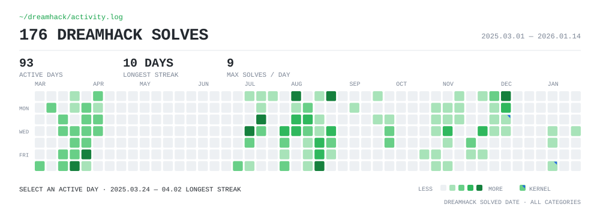

<p align="right"><a href="./README.ko.md">한국어</a></p>

# Taegu Ha

**Vulnerability Researcher · Systems & Product Security**

I investigate real products and codebases across the Linux kernel, open-source software, AI-agent systems, Windows kernel, and embedded devices. I use automation and LLMs to narrow investigation scope—never as vulnerability proof—and close findings through human validation, controlled reproduction, coordinated disclosure, and upstream evidence.

[Public CVE case studies](https://github.com/foxirain/CVE-public) · [Linux mainline contributions](#linux-mainline-contributions) · [Dreamhack](https://dreamhack.io/users/71306) · [Email](mailto:hataegu0826@gmail.com)

```text
attack surface → reachability → broken invariant → controlled reproduction → disclosure → patch
```

## Evidence at a glance

| Evidence | Public record |
| --- | --- |
| **15 public CVE case studies** | Published analyses with retained source provenance and SHA-256 evidence manifests |
| **13 direct public attributions** | Publicly credited vulnerability research outcomes |
| **2 Linux kernel CVEs** | [CVE-2026-31720](https://github.com/foxirain/CVE-public/tree/main/cases/CVE-2026-31720) · [CVE-2026-53075](https://github.com/foxirain/CVE-public/tree/main/cases/CVE-2026-53075) |
| **3 authored mainline Linux patches** | Two CVE fixes and one separate BPF verifier fix |
| **154 Dreamhack Pwnable solves** | [4,901 total Wargame points](https://dreamhack.io/users/71306) · long-term systems exploitation practice |

<sub>The case-study and attribution counts describe different scopes and are not additive.</sub>

## Selected research

| Work | What it demonstrates | Public evidence |
| --- | --- | --- |
| [**CVE-public**](https://github.com/foxirain/CVE-public) | Evidence-preserving vulnerability documentation across memory safety, authorization, SSRF, OAuth, agent security, and CI/CD | 15 case archives · source provenance · per-case evidence hashes |
| [**Kernel Codex Harness lineage**](https://github.com/foxirain/linux-kernel-codex-harness-v2) | Evidence-driven attention allocation and provenance-aware triage for Linux kernel review | [v1-assisted CVE-2026-31720](https://github.com/foxirain/linux-kernel-codex-harness) · [v2-assisted CVE-2026-53075](https://github.com/foxirain/linux-kernel-codex-harness-v2) |
| [**Adaptive OSS Vulnerability Harness**](https://github.com/foxirain/codex-adaptive-oss-vuln-harness) | Isolated search hypotheses that converge on a shared evidence contract across languages and product classes | Public research lineage · explicit provenance and validity limits |
| [**Agent Security Company**](https://github.com/foxirain/agent-security-company) | Containment, identity, privilege, network, QA, and disclosure boundaries around AI-assisted research | Evidence ledger · publication-safety policy · 140/140 public regression checks |

## Linux mainline contributions

- [`6e0e34d85cd4`](https://git.kernel.org/pub/scm/linux/kernel/git/torvalds/linux.git/commit/?id=6e0e34d85cd46ceb37d16054e97a373a32770f6c) — USB UAC1 control-request length validation · CVE-2026-31720
- [`2bb6379416fd`](https://git.kernel.org/pub/scm/linux/kernel/git/torvalds/linux.git/commit/?id=2bb6379416fd19f44c3423a00bfd8626259f6067) — PPP target-network-namespace capability validation · CVE-2026-53075
- [`de36adca6346`](https://git.kernel.org/pub/scm/linux/kernel/git/torvalds/linux.git/commit/?id=de36adca634634c205a9eb8b56a28175ab7abf5f) — BPF verifier oversized access-size validation and regression coverage

## Systems exploitation foundation

[**Dreamhack · Amemoyoi**](https://dreamhack.io/users/71306) · [Long-form project record](https://whoami-iota-gilt.vercel.app/3c97c60c09f3810dbf87dc57e6603f3e)

- **154 Pwnable challenges** solved across memory corruption, ROP/SROP, heap exploitation, glibc/FSOP, ARM/AArch64, and Linux kernel exploitation
- **4,901 Wargame points** · reached the overall **Top 300** during the project · 259 analysis, experiment, and troubleshooting records retained
- Progressed from user-space primitives to controlled kernel AAR/AAW and `cred` overwrite in Dreamhack's educational environments

<p align="center">
  <a href="https://whoami-iota-gilt.vercel.app/3c97c60c09f3810dbf87dc57e6603f3e">
    
  </a>
</p>

<sub>Fixed activity snapshot through 2026-01-14: 176 solves across all categories on 93 active days. The 154 figure above is the Pwnable subset recorded at project completion.</sub>

## Research interests

Linux kernel security · vulnerability research · product and OSS security · embedded and device security · Windows kernel security · reproducible security validation

## Contact

I am preparing for vulnerability research, product security, and systems security roles.

**Email:** [hataegu0826@gmail.com](mailto:hataegu0826@gmail.com)
