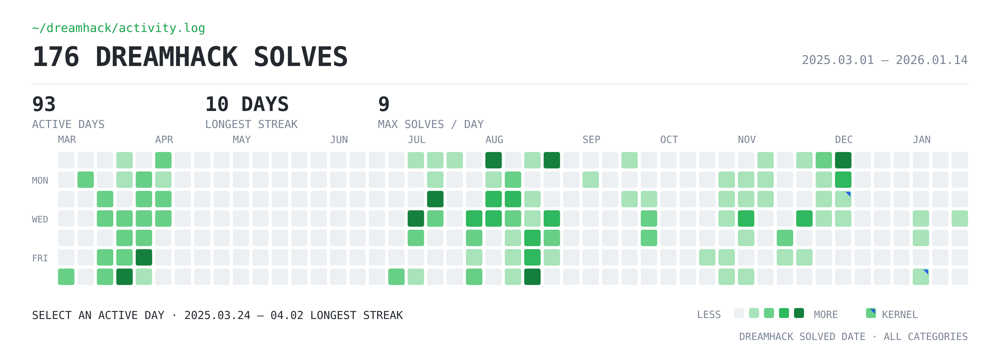

[프로필](../README.ko.md) · [English](./research.en.md)

# 연구 상세

**시스템·임베디드 보안 연구**

Linux 커널과 ARM 기반 소프트웨어의 취약점을 연구합니다. 소스와 바이너리를 분석하고, 검증에 필요한 환경과 도구를 직접 만듭니다. 발견한 문제는 재현·제보하고 수정 패치와 리뷰까지 이어갑니다.

[공개 CVE 기록](https://github.com/foxirain/CVE-public) · [연구 도구](#연구-도구) · [Dreamhack](https://dreamhack.io/users/71306) · [이메일](mailto:hataegu0826@gmail.com)

## 대표 연구

| 대상 | 수행한 일 | 근거 |
| :--- | :--- | :--- |
| Linux 커널 | USB UAC1·PPP 취약점 수정과 BPF verifier 검증 오류 수정. 직접 작성한 **패치 3건이 mainline에 반영**됐습니다. | [UAC1 패치](https://git.kernel.org/pub/scm/linux/kernel/git/torvalds/linux.git/commit/?id=6e0e34d85cd46ceb37d16054e97a373a32770f6c) · [PPP 패치](https://git.kernel.org/pub/scm/linux/kernel/git/torvalds/linux.git/commit/?id=2bb6379416fd19f44c3423a00bfd8626259f6067) · [BPF 패치](https://git.kernel.org/pub/scm/linux/kernel/git/torvalds/linux.git/commit/?id=de36adca634634c205a9eb8b56a28175ab7abf5f) |
| libpng | ARM/AArch64 NEON의 메모리 경계 오류를 발견·검증하고 수정 패치를 직접 작성했습니다. **libpng 1.6.56에 반영**됐습니다. | [CVE-2026-33636](https://github.com/foxirain/CVE-public/tree/main/cases/CVE-2026-33636) |
| 임베디드 통신 | ESP32 NBNS 파서의 메모리 손상과 NimBLE BLE 응답 처리의 비정상 종료를 분석·제보했습니다. | [ESP32](https://github.com/foxirain/CVE-public/tree/main/cases/CVE-2026-41429) · [NimBLE](https://github.com/foxirain/CVE-public/tree/main/cases/CVE-2026-45815) |
| PraisonAI | A2A 예제의 비인증 코드 실행과 CI 워크플로의 명령 주입을 발견·제보했습니다. **Critical 2건**이 CVE로 공개되고 공식 수정됐습니다. | [A2A](https://github.com/foxirain/CVE-public/tree/main/cases/CVE-2026-47391) · [CI](https://github.com/foxirain/CVE-public/tree/main/cases/CVE-2026-48168) |
| Langflow | 동적 코드 검증 누락으로 실행 금지 정책을 우회하는 문제를 분석하고, 통합 실행으로 검증·보고했습니다. | [CVE-2026-9135](https://github.com/foxirain/CVE-public/tree/main/cases/CVE-2026-9135) |

LinkAce·NamelessMC·OpenFGA·Caddy·listmonk에서는 SSRF, 접근 통제, 캐시 격리, OAuth 검증 등을 연구했습니다. [전체 공개 기록 보기](https://github.com/foxirain/CVE-public)

사례별 분석과 기여 범위

- Linux 커널: [USB UAC1 · CVE-2026-31720](https://github.com/foxirain/CVE-public/tree/main/cases/CVE-2026-31720)의 제어 요청 길이 검증과 [PPP · CVE-2026-53075](https://github.com/foxirain/CVE-public/tree/main/cases/CVE-2026-53075)의 대상 네트워크 네임스페이스 권한 검사를 수정했습니다. 별도 BPF verifier 패치에는 검증 오류 수정과 회귀 테스트를 포함했습니다.
- 공개 아카이브는 **CVE 15개 사례**를 담고 있습니다. 공개 연구자 귀속 13건, listmonk 공동 기여 1건, 개인 보고 기록을 보유한 Langflow 1건으로 구분합니다. 공개 권고에서 사용하는 이름은 **foxirain · Amemoyoi**입니다.
- listmonk의 두 권한 우회 변형은 여러 연구자의 보고와 합쳐 **CVE 1건**으로 공개됐습니다. Langflow는 개인 보고 기록을 보유하며, 공식 공개 공지에 개인 연구자 이름은 기재되지 않았습니다.
- 위 웹·인가 연구는 7개 CVE 사례이며, 전체 아카이브에 포함됩니다.

## 연구 도구

| 프로젝트 | 직접 설계·개발한 내용 |
| :--- | :--- |
| [RehostRace](https://github.com/foxirain/rehostrace) | 비동기 이벤트의 인과관계와 실행 순서를 보존하며 객체 수명을 검증하는 리호스팅·재생 프레임워크 |
| [VeriRehost](https://github.com/foxirain/verirehost) | 펌웨어의 원본 코드 구간을 실행하고 환경 모델·입력·실행 결과를 구분해 기록하는 리호스팅 프레임워크 |
| [Linux Kernel Harness](https://github.com/foxirain/linux-kernel-codex-harness-v2) | 커널 코드의 조사 우선순위를 정하고 분석 근거를 관리하는 연구 하네스. UAC1·PPP 연구에는 각 버전의 하네스를 활용 |
| [OSS Harness](https://github.com/foxirain/codex-oss-vuln-harness-v2) · [Adaptive Harness](https://github.com/foxirain/codex-adaptive-oss-vuln-harness) | 외부 신호의 유무와 탐색 방향을 나눠 조사 대상을 선정하는 Python 하네스. 직접 활용한 분석·제보로 **공개 CVE 11건에 기여**(listmonk 공동 기여 1건 포함) |
| [Agent Egress Lock](https://github.com/foxirain/agent-egress-lock) · [Agent Security Company](https://github.com/foxirain/agent-security-company) | Docker·프록시를 이용한 통신 통제에서 출발해, Linux 사용자별 작업 권한과 독립 QA 검토를 관리하는 실행 환경으로 확장 |

OSS·Adaptive의 11건은 libpng·Langflow와 Linux 커널 사례를 제외한 집계입니다.

## 학습과 팀 프로젝트

화이트햇 스쿨 2기 WhiteGang 팀에서 Windows 사용자 모드·커널 드라이버를 개발했습니다. DLL 로딩 통제와 프로세스 핸들 권한 제한을 구현했습니다.  
[PalAnticheat](https://github.com/foxirain/PalAnticheat) · [PalAnticheatEx](https://github.com/foxirain/PalAnticheatEx)

Dreamhack에서 **Pwnable 154문제**를 풀며 사용자 공간의 메모리 오류부터 Linux 커널까지 공부했습니다. x86·ARM 환경에서 디버깅하고 glibc와 커널 소스로 동작을 확인했습니다.

Dreamhack 학습 기록과 활동 그래프

[Dreamhack · Amemoyoi](https://dreamhack.io/users/71306) · [장기 프로젝트 기록](https://whoami-iota-gilt.vercel.app/3c97c60c09f3810dbf87dc57e6603f3e)

- 학습 범위: 메모리 손상, ROP/SROP, 힙, glibc/FSOP, ARM/AArch64, Linux 커널.
- 교육 환경에서 사용자 공간의 기초 기법부터 커널 메모리 읽기·쓰기와 권한 구조 분석으로 확장했습니다.
- 프로젝트 당시 Wargame **4,901점**, 전체 **Top 300** 진입. 분석·실험·문제 해결 기록 **259개**를 보관하고 있습니다.

2025년 3월부터 2026년 1월까지의 활동 기록입니다. 전체 Wargame 176문제·활동일 93일이며, Pwnable 154문제와 집계 범위가 다릅니다.

## 연락

시스템·임베디드 취약점 분석과 연구 도구 개발 직무에 관심이 있습니다. 제품 보안과 AI·에이전트 보안 연구도 함께하고 있습니다.

[hataegu0826@gmail.com](mailto:hataegu0826@gmail.com)
